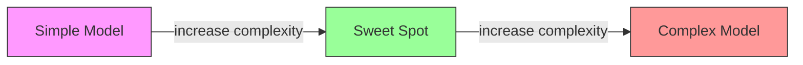
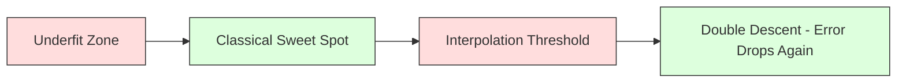
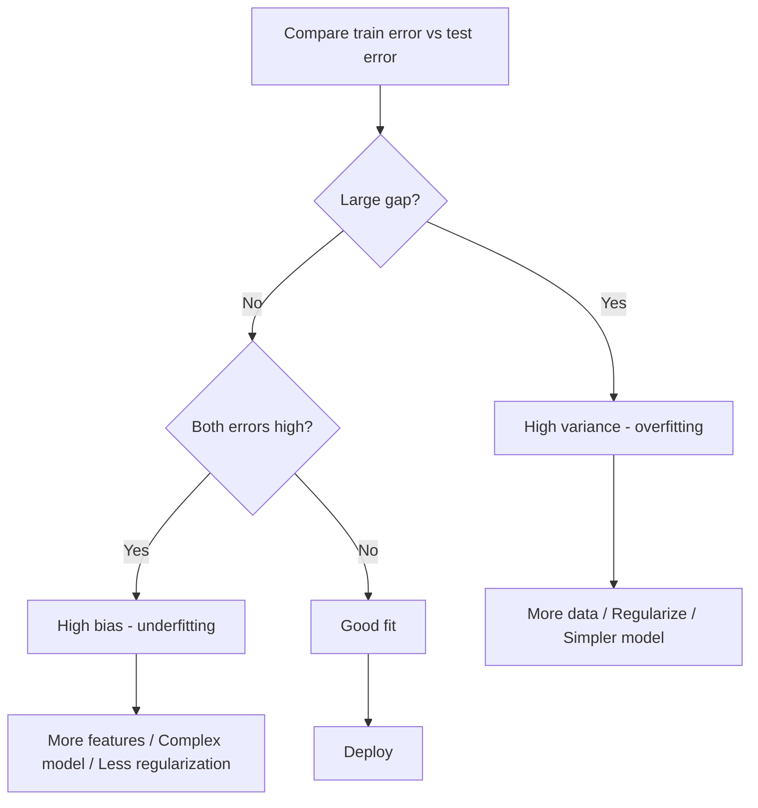

# Bias-Variance Tradeoff

> Every model error comes from one of three sources: bias, variance, or noise. You can only control the first two.

**Type:** Learn
**Language:** Python
**Prerequisites:** Phase 2, Lessons 01-09 (ML basics, regression, classification, evaluation)
**Time:** ~75 minutes

## The Problem

You trained a model. It has some error on test data. Where does that error come from?

If your model is too simple (linear regression on a curved dataset), it will consistently miss the true pattern. That is bias. If your model is too complex (degree-20 polynomial on 15 data points), it will fit the training data perfectly but give wildly different predictions on new data. That is variance.

You cannot minimize both at the same time for a fixed model capacity. Push bias down and variance goes up. Push variance down and bias goes up. Understanding this tradeoff is the single most useful diagnostic skill in machine learning. It tells you whether to make your model more complex or less complex, whether to get more data or engineer better features, whether to regularize more or less.

## The Concept

### Bias: Systematic Error

Bias measures how far off your model's average prediction is from the true value. If you trained the same model on many different training sets drawn from the same distribution and averaged the predictions, bias is the gap between that average and the truth.

High bias means the model is too rigid to capture the real pattern. A straight line fit to a parabola will always miss the curve, no matter how much data you give it. This is underfitting.

```
High bias (underfitting):
  Model always predicts roughly the same wrong thing.
  Training error: HIGH
  Test error: HIGH
  Gap between them: SMALL
```

### Variance: Sensitivity to Training Data

Variance measures how much your predictions change when you train on different subsets of data. If small changes in the training set cause large changes in the model, variance is high.

High variance means the model is fitting noise in the training data, not the underlying signal. A degree-20 polynomial will thread through every training point but oscillate wildly between them. This is overfitting.

```
High variance (overfitting):
  Model fits training data perfectly but fails on new data.
  Training error: LOW
  Test error: HIGH
  Gap between them: LARGE
```

### The Decomposition

For any point x, the expected prediction error under squared loss decomposes exactly:

```
Expected Error = Bias^2 + Variance + Irreducible Noise

where:
  Bias^2   = (E[f_hat(x)] - f(x))^2
  Variance = E[(f_hat(x) - E[f_hat(x)])^2]
  Noise    = E[(y - f(x))^2]             (sigma^2)
```

- `f(x)` is the true function
- `f_hat(x)` is your model's prediction
- `E[...]` is the expectation over different training sets
- `y` is the observed label (true function plus noise)

The noise term is irreducible. No model can do better than sigma^2 on noisy data. Your job is to find the right balance between bias^2 and variance.

### Model Complexity vs Error



The classic U-shaped curve:

| Complexity | Bias | Variance | Total Error |
|-----------|------|----------|-------------|
| Too low | HIGH | LOW | HIGH (underfitting) |
| Just right | MODERATE | MODERATE | LOWEST |
| Too high | LOW | HIGH | HIGH (overfitting) |

### Regularization as Bias-Variance Control

Regularization deliberately increases bias to reduce variance. It constrains the model so it cannot chase noise.

- **L2 (Ridge):** Shrinks all weights toward zero. Keeps all features but reduces their influence.
- **L1 (Lasso):** Pushes some weights exactly to zero. Performs feature selection.
- **Dropout:** Randomly disables neurons during training. Forces redundant representations.
- **Early stopping:** Stops training before the model fully fits the training data.

The regularization strength (lambda, dropout rate, number of epochs) directly controls where you sit on the bias-variance curve. More regularization means more bias, less variance.

### Double Descent: The Modern Perspective

Classical theory says: after the sweet spot, more complexity always hurts. But research since 2019 has shown something unexpected. If you keep increasing model capacity far past the interpolation threshold (where the model has enough parameters to perfectly fit training data), test error can decrease again.



This "double descent" phenomenon explains why massively overparameterized neural networks (with far more parameters than training examples) still generalize well. The classical bias-variance tradeoff is not wrong, but it is incomplete for the modern regime.

Key observations about double descent:
- It happens in linear models, decision trees, and neural networks
- More data can actually hurt in the interpolation region (sample-wise double descent)
- More training epochs can cause it too (epoch-wise double descent)
- Regularization smooths out the peak but does not eliminate it

### Diagnosing Your Model



| Symptom | Diagnosis | Fix |
|---------|-----------|-----|
| High train error, high test error | Bias | More features, complex model, less regularization |
| Low train error, high test error | Variance | More data, regularization, simpler model, dropout |
| Low train error, low test error | Good fit | Ship it |
| Train error decreasing, test error increasing | Overfitting in progress | Early stopping |

### Practical Strategies

**When bias is the problem:**
- Add polynomial or interaction features
- Use a more flexible model (tree ensemble instead of linear)
- Reduce regularization strength
- Train longer (if not yet converged)

**When variance is the problem:**
- Get more training data
- Use bagging (random forests)
- Increase regularization (higher lambda, more dropout)
- Feature selection (remove noisy features)
- Use cross-validation to detect it early

## Build It

The code in `code/bias_variance.py` runs the full bias-variance decomposition experiment:

1. Generates data from a known function with controlled noise
2. Trains polynomial models of varying complexity on many bootstrap samples
3. Computes bias^2, variance, and total error at each complexity level
4. Shows the tradeoff curve and identifies the optimal complexity
5. Demonstrates regularization's effect on the decomposition

## Exercises

1. Run the decomposition with `noise_std=0` (no noise). What happens to the irreducible error term? Does the optimal complexity change?

2. Increase the training set size from 30 to 300. How does this affect the variance component? Does the optimal polynomial degree shift?

3. Add L2 regularization (Ridge regression) to the experiment. For a fixed high-degree polynomial (degree 15), sweep lambda from 0 to 100. Plot bias^2 and variance as functions of lambda.

4. Modify the true function from a polynomial to `sin(x)`. How does the bias-variance decomposition change? Is there still a clear optimal degree?

5. Implement a simple bootstrap aggregating (bagging) wrapper: train 10 models on bootstrap samples and average predictions. Show that this reduces variance without increasing bias much.

## Key Terms

| Term | What people say | What it actually means |
|------|----------------|----------------------|
| Bias | "The model is too simple" | Systematic error from wrong assumptions. The gap between the average model prediction and truth. |
| Variance | "The model is overfitting" | Error from sensitivity to training data. How much predictions change across different training sets. |
| Irreducible error | "Noise in the data" | Error from randomness in the true data-generating process. No model can eliminate it. |
| Underfitting | "Not learning enough" | Model has high bias. It misses the real pattern even on training data. |
| Overfitting | "Memorizing the data" | Model has high variance. It fits noise in training data that does not generalize. |
| Regularization | "Constraining the model" | Adding a penalty to reduce model complexity, trading bias for lower variance. |
| Double descent | "More parameters can help" | Test error decreases again when model capacity far exceeds the interpolation threshold. |
| Model complexity | "How flexible the model is" | The capacity of a model to fit arbitrary patterns. Controlled by architecture, features, or regularization. |

## Further Reading

- [Hastie, Tibshirani, Friedman: Elements of Statistical Learning, Ch. 7](https://hastie.su.domains/ElemStatLearn/) -- the definitive treatment of bias-variance decomposition
- [Belkin et al., Reconciling modern machine learning practice and the bias-variance trade-off (2019)](https://arxiv.org/abs/1812.11118) -- the double descent paper
- [Nakkiran et al., Deep Double Descent (2019)](https://arxiv.org/abs/1912.02292) -- epoch-wise and sample-wise double descent
- [Scott Fortmann-Roe: Understanding the Bias-Variance Tradeoff](http://scott.fortmann-roe.com/docs/BiasVariance.html) -- clear visual explanation
